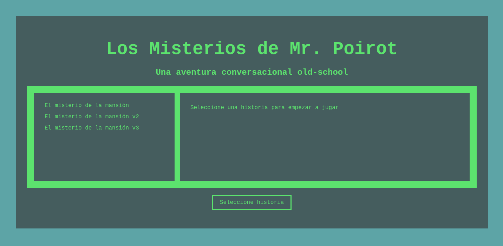
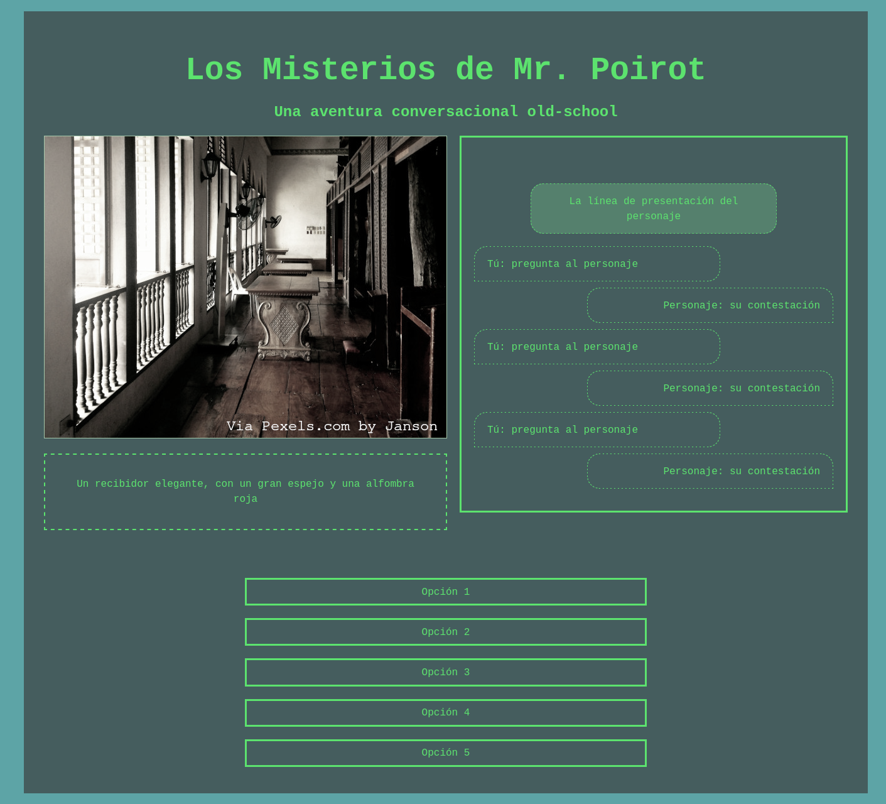

# Poirot.js

## Introducción

Poirot.js es un juego conversacional creado con fines didácticos para mostrar
las diferencias entre distintos paradigmas de diseño de software.

La sección de Requisitos Básicos describe en detalle las funcionalidades que debe
proporcionar el juego en lenguaje natural. El objetivo es que el desarrollador
transforme estos requisitos en un conjunto de requisitos formales y pruebas
funcionales que permitan la implementación del resultado final.

La sección de Requisitos Avanzados ofrece algunos ejercicios más avanzados para
el que desee continuar con el desarrollo.

La plantilla inicial cuenta con una interfaz básica que debería ser suficiente
para la implementación del ejercicio (aunque los requisitos avanzados podrían
requerir de algún cambio).

## Requisitos Básicos

Los requisitos básicos están agrupados por temáticas.

### Interfaz

#### Pantalla de selección de historias

- Muestra un listado de todas las historias disponibles
- Permite seleccionar una de las historias en el listado, mostrando su descripción
- Permite comenzar una historia pulsando el botón Comenzar
- Mientras no hay ninguna historia seleccionada, el botón Comenzar se muestra deshabilitado
  con un mensaje "Seleccione historia"

#### Pantalla de juego

- Muestra la imagen de la localización actual
- Muestra la descripción de la localización actual
- Muestra las opciones disponibles para el usuario
  - Hablar con cada uno de los personajes en la localización
  - Cambiar a una localización conectada
  - Volver a la localización original
  - Salir del juego
- Muestra una historia de todos los diálogos del personaje en la parte derecha de la pantalla

### Carga de historias

- El juego ofrecerá un número variable de historias, que se leerán de la carpeta
  `/stories` del código.
- Cada historia contendrá:
  - Un listado de localizaciones conectadas
  - Un listado de personajes, ubicados cada uno en una de las localizaciones
  - Un listado de pruebas, ubicadas cada uno en una de las localizaciones
- Cada personaje contendrá un árbol de diálogo, en el que cada nodo constará de
  un texto introductorio y una pregunta. Cada nodo hijo contendrá también una
  respuesta a la pregunta planteada por el nodo padre. Algunas opciones de
  diálogo estarán marcadas opcionalmente como de un solo uso.
- Cada prueba contendrá una serie de condiciones para ser encontrada, consistente
  a su vez en un listado de otras pruebas.
- Las historias contendrán una casilla inicial de jugador.

### Árboles de diálogo

- Al escoger hablar con un personaje:
  - Se le mostrará la frase inicial del diálogo
  - y se le ofrecerán al jugador las opciones del nodo inicial
- Para cada nodo de diálogo, se le mostrarán al jugador el texto de la pregunta (como
  detective), el texto de la respuesta (como testigo), las opciones de continuación y
  una opción genérica de cambio de tema para volver al primer nodo.
- Si el diálogo de un árbol llega al final, se muestra el diálogo de continuación
  del nodo inicial y de nuevo las mismas opciones (excepto las que estén marcadas
  como únicas y ya hayan sido visitadas)

### Desarrollo del juego

- El jugador podrá hacer una acción por turno. Esta acción será una de entre las
  siguientes:

  - Hablar con un personaje

  - Cambiar a una localización adyacente a la actual

## Requisitos Avanzados

### Árboles de diálogo

- Cuando un jugador haya contestado una vez a una pregunta de un solo uso, esa
  pregunta no aparecerá más en las opciones de ese personaje.
- Cuando un jugador haya contestado una pregunta con un nodo que tenga una recompensa
  se le avisará de que la ha obtenido, y se agregará a su inventario
- Los nodos de diálogo podrán contener, opcionalmente, una recompensa por llegar
- (en forma de prueba).

### Pruebas y fin de juego

- El jugador puede hacer dos acciones adicionales:

  - Buscar pruebas
  - Ver inventario de pruebas

- Cada historia tiene una **prueba crucial** que finaliza el juego.
- Cuando un jugador obtenga la prueba crucial, el juego terminará con éxito
- Cuando un jugador busque pruebas en una localización en la que existe alguna,
  si el jugador cumple los prerequisitos de la prueba, se le mostrará un mensaje
  diciendo que la ha encontrado y se añadirá a su inventario
- Cuando un jugador busque pruebas en una localización sin pruebas o en una localización
  con pruebas cuyos prerequisitos no cumple, se le indicará que no ha encontrado pruebas
- Si alguno de los requisitos de la **prueba crucial** es una recompensa de una
  línea de diálogo que ya no se podrá visitar, podría darse el caso de que el
  jugador no pudiera de ninguna forma terminar la historia. Presentar en estos
  casos un cartel de Game Over.

## Las Historias (JSON)

Este apartado describe el formato JSON en el que están escritas las historias
que deberá interpretar la aplicación.

Todas las historias contienen cuatro apartados generales:

- _locations_: listado de las localizaciones disponibles (ver Localizaciones)
- _clues_: listado de las pistas disponibles en localizaciones (ver Pistas)
- _characters_: listado de los personajes de la historia (ver Personajes)
- _finalClue_: un único string con el nombre de la pista cuya posesión termina el juego

### Localizaciones

Las localizaciones representan los distintos escenarios que puede visitar el jugador,
y forman un grafo conectado. Cada localización tiene los siguientes atributos:

- _name_: nombre de la localización
- _image_: nombre de fichero de la imagen de la localización (a partir de `/assets/img`)
- _description_: descripción en modo texto
- _connections_: listado de los nombres de las localizaciones conectadas con esta

### Pistas

Las pistas representan los objetos relacionados con el caso que los detectives pueden
encontrar en cada una de las localizaciones. Cada pista tiene los siguientes atributos:

- _name_: nombre de la pista
- _description_: descripción de la pista
- _location_: localización en la que está situada
- _requisites_: listado de pistas necesarias para desbloquear esta pista en su localización

### Personajes

Este es el listado de personajes que participan en la historia, junto con todas sus
opciones de diálogo. Los personajes pueden tener los siguientes atributos:

- _name_: nombre del personaje
- _description_: descripción del personaje
- _location_: localización en la que se encuentra
- _dialog_: árbol de diálogo del personaje (ver Árboles de diálogo)

### Árboles de diálogo

Los árboles de diálogo contienen todas las opciones de diálogo de cada personaje. Todos los
árboles de diálogo contienen un nodo inicial, con la presentación del personaje.
Este nodo inicial contiene los siguientes atributos:

- _initial_: diálogo de presentación del personaje
- _continuation_: frase de transición entre opciones
- _final_: despedida del personaje
- _options_: opciones de conversación del jugador

Las opciones de conversación del jugador están formadas por nodos de diálogo, donde cada
uno tiene los siguientes atributos:

- _question_: pregunta que se plantea en la opción de diálogo
- _answer_: contestación del personaje
- _single_: indica que la opción estará disponible una única vez
- _clue_: pista que se añade al inventario del jugador
- _options_: listado de opciones a seguir después de esta
